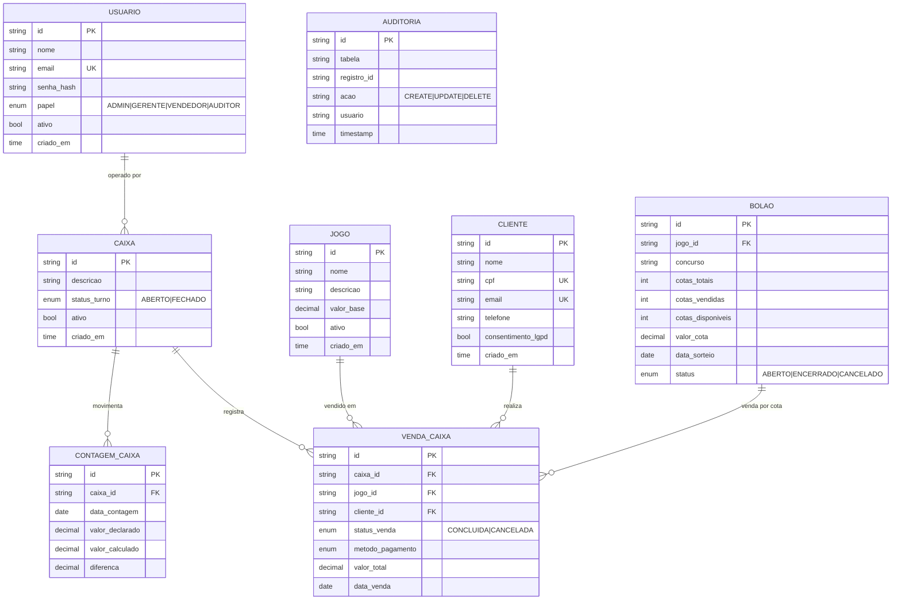

# Loteria360 — Backend (Spring Boot)

Sistema de gestão completo para **casas lotéricas** com foco em **operações de caixa**, **vendas de jogos**, **bolões**, **clientes**, **relatórios** e **dashboard**. Projeto baseado em **Spring Boot 3.3.0** e **Java 17**, com segurança **JWT**, migrações **Flyway** e documentação **OpenAPI/Swagger**.

> Este README foi gerado a partir da análise do repositório fornecido, cobrindo tecnologias, estrutura, endpoints, regras de negócio e instruções de execução.

---

## Sumário
- [Visão Geral](#-visão-geral)
- [Principais Funcionalidades](#-principais-funcionalidades)
- [Arquitetura & Padrões](#-arquitetura--padrões)
- [Tecnologias & Dependências](#-tecnologias--dependências)
- [Estrutura do Projeto](#-estrutura-do-projeto)
- [Modelo de Domínio](#-modelo-de-domínio)
- [Segurança & Autorização](#-segurança--autorização)
- [API & Endpoints](#-api--endpoints)
- [Regras de Negócio (Resumo)](#-regras-de-negócio-resumo)
- [Erros & Tratamento Global](#-erros--tratamento-global)
- [Banco de Dados & Migrações](#-banco-de-dados--migrações)
- [Como Executar (Local, Docker, Testes)](#-como-executar-local-docker-testes)
- [Observabilidade & Logs](#-observabilidade--logs)
- [Roadmap / Próximos Passos](#-roadmap--próximos-passos)
- [Licença](#-licença)

---
## Visão Geral

O **Loteria360 Backend** fornece uma API REST para gerir o dia a dia de uma casa lotérica:

- Cadastro e gestão de **Usuários** (perfis: `ADMIN`, `GERENTE`, `VENDEDOR`, `AUDITOR`).
- **Autenticação** via JWT e proteção de rotas por perfil.
- Cadastro de **Jogos** e **Bolões** (com controle de cotas).
- Fluxos de **Caixa** (abertura/encerramento/turno), **Vendas**, **Contagens** e **Relatórios**.
- **Dashboard** com métricas de vendas, séries temporais e resumos.
- **Auditoria** automática de operações críticas.

A API é auto-documentada via **OpenAPI/Swagger** e exposta em `/swagger-ui.html`.

---
## Principais Funcionalidades
- **Usuários**: CRUD, ativação/desativação, troca de senha, perfil e status.
- **Autenticação**: login que retorna **JWT** (Bearer).
- **Jogos**: cadastro, ativação/desativação, listagem paginada/ativas.
- **Bolões**: cadastro, controle de cotas (totais/vendidas/disponíveis), status (`ABERTO`, `ENCERRADO`, `CANCELADO`).
- **Clientes**: cadastro, consulta por CPF/e-mail/nome, consentimento LGPD (quando aplicável).
- **Caixas**: abertura de turno, lançamentos e contagens de caixa, pagamentos, cancelamentos.
- **Vendas**: registro de vendas por jogo/bolão, métodos de pagamento, status de venda.
- **Relatórios**: vendas, contagens e consolidado por períodos.
- **Dashboard**: métricas agregadas, sumários e tendências (últimos _N_ dias).
- **Auditoria**: AOP para registrar ações em entidades críticas.

---

## Arquitetura & Padrões
- **Camadas**: `controller` → `service` → `repository` (+ `mapper`/`dto`).
- **Spring MVC** com validação (`jakarta.validation`) e **DTOs**.
- **Segurança**: Spring Security + filtro `JwtAuthFilter` (stateless).
- **AOP de Auditoria**: `AuditAspect` registra operações (tabela, id, ação, usuário/hora).
- **Migrations** com **Flyway** (`db/migration`).
- **Documentação**: `springdoc-openapi`.
- **Configuração** por perfis (`application.yml`, `application-dev.yml`, `application-test.yml`).

Diagrama resumido (Mermaid):

```mermaid
flowchart LR
  UI[Frontend / Postman] --> API[Spring Boot API]
  API --> SEC[Spring Security (JWT)]
  API --> CTL[Controllers]
  CTL --> SRV[Services]
  SRV --> REPO[Repositories (Spring Data JPA)]
  REPO --> DB[(MySQL 8)]
  SRV --> MAP[MapStruct]
  API --> SWG[Swagger / OpenAPI]
  API --> AOP[AOP - AuditAspect]
  API --> LOG[Logback + MDC traceId]
```

---
## Tecnologias & Dependências

- **Linguagem**: Java 17
- **Framework**: Spring Boot 3.3.0 (Web, Validation, Security, Actuator)
- **Persistência**: Spring Data JPA + MySQL 8
- **Migrações**: Flyway
- **Auth**: JWT (jjwt-api/impl/jackson)
- **Documentação**: springdoc-openapi-starter-webmvc-ui
- **Mapeamento**: MapStruct
- **Boilerplate**: Lombok
- **Build**: Maven (mvnw)
- **Testes**: JUnit 5, Testcontainers (perfil `test`)
- **Container**: Dockerfile multi-stage + `docker-compose.yml` (MySQL + Adminer)
- **Logs**: Logback JSON (MDC `traceId` via `TraceIdFilter`)

---
## Estrutura do Projeto (alto nível)

```
Loterica360-backend/
├─ docker/                 # Infra local (MySQL/Adminer)
├─ src/
│  ├─ main/java/com/loteria360/
│  │  ├─ controller/      # REST controllers
│  │  ├─ service/         # Regras de negócio
│  │  ├─ repository/      # Spring Data JPA repos
│  │  ├─ domain/
│  │  │  ├─ model/        # Entidades JPA (Usuario, Jogo, Bolao, ...)
│  │  │  ├─ dto/          # DTOs de request/response
│  │  │  └─ mapper/       # MapStruct mappers
│  │  ├─ security/        # JWT, filtros e detalhes do usuário
│  │  ├─ config/          # SecurityConfig, OpenAPI, Jackson, ExceptionHandler...
│  │  ├─ audit/           # AuditAspect e serviço de auditoria
│  │  └─ util/            # utilitários (ex.: PasswordGeneratorUtil)
│  └─ main/resources/
│     ├─ application.yml / application-dev.yml / application-test.yml
│     ├─ db/migration/    # Flyway (V1__baseline.sql, V2__seed_data.sql, ...)
│     └─ logback-spring.xml
├─ Dockerfile
├─ docker-compose.yml
├─ Makefile
└─ pom.xml
```
---
## Modelo de Domínio

**Entidades (principais)**:  
AcaoAuditoria, Auditoria, Bolao, Caixa, Cliente, ComissaoRegra, ContagemCaixa, EscopoComissao, Jogo, MetodoPagamento, PapelUsuario, StatusBolao, StatusPagamento, StatusTurno, StatusVenda, TipoMovimentoCaixa, TipoVenda, Usuario, VendaCaixa

**DTOs** (amostra):  
AbrirTurnoRequest, AlterarSenhaRequest, AtualizarBolaoRequest, AtualizarJogoRequest, AtualizarUsuarioRequest, BolaoResponse, CaixaRequest, CaixaResponse, CancelarVendaRequest, ClienteRequest, ClienteResponse, ContagemCaixaRequest, ContagemCaixaResponse, CriarBolaoRequest, CriarJogoRequest, CriarUsuarioRequest, JogoResponse, LoginRequest, LoginResponse, MovimentoCaixaRequest...

Diagrama ER (simplificado):



> Observação: os campos exatos podem variar conforme a implementação; veja os scripts em `db/migration` para a fonte da verdade.

---
## Segurança & Autorização

- **JWT Bearer** via `Authorization: Bearer <token>`
- **Filtro**: `JwtAuthFilter` popula o contexto de segurança.
- **Perfis / Papéis** (`PapelUsuario`): `ADMIN`, `GERENTE`, `VENDEDOR`, `AUDITOR`.
- **Restrições** adicionais via `@PreAuthorize` nos controllers.
- **Resolução de Usuário Atual**: `@CurrentUser`/`CurrentUserArgumentResolver`.

**Rotas públicas (tipicamente):**
- `POST /api/v1/auth/login`
- `GET /swagger-ui.html`, `GET /v3/api-docs/**`
- `GET /actuator/health` (se exposto)

Variáveis recomendadas (via `application.yml` ou `ENV`):
```yaml
app:
  jwt:
    secret: "troque-por-uma-chave-base64-de-256-bits"
    expiration: 86400000   # 24h em ms
```

> Use `PasswordGeneratorUtil` para gerar **hashes BCrypt** de senhas seguras.

---
## API & Endpoints

Abaixo um inventário **gerado** a partir dos controllers:

| Método | Caminho | Handler |
|---|---|---|
| `POST` | `/api/v1/auth/login` | `AuthController.login()` |
| `POST` | `/api/v1/auth/logout` | `AuthController.logout()` |
| `GET` | `/api/v1/auth/me` | `AuthController.getCurrentUser()` |
| `GET` | `/api/v1/boloes` | `BolaoController.listarBoloes()` |
| `POST` | `/api/v1/boloes` | `BolaoController.criarBolao()` |
| `GET` | `/api/v1/boloes/ativos` | `BolaoController.listarBoloesAtivos()` |
| `DELETE` | `/api/v1/boloes/{id}` | `BolaoController.deletarBolao()` |
| `GET` | `/api/v1/boloes/{id}` | `BolaoController.buscarBolaoPorId()` |
| `PUT` | `/api/v1/boloes/{id}` | `BolaoController.atualizarBolao()` |
| `PATCH` | `/api/v1/boloes/{id}/toggle-status` | `BolaoController.alterarStatusBolao()` |
| `GET` | `/api/v1/caixas` | `CaixaController.listarCaixas()` |
| `POST` | `/api/v1/caixas` | `CaixaController.criarCaixa()` |
| `GET` | `/api/v1/caixas/ativas` | `CaixaController.listarCaixasAtivas()` |
| `GET` | `/api/v1/caixas/{id}` | `CaixaController.buscarPorId()` |
| `PUT` | `/api/v1/caixas/{id}` | `CaixaController.atualizarCaixa()` |
| `GET` | `/api/v1/clientes` | `ClienteController.listarClientes()` |
| `POST` | `/api/v1/clientes` | `ClienteController.criarCliente()` |
| `GET` | `/api/v1/clientes/search` | `ClienteController.buscarClientes()` |
| `GET` | `/api/v1/clientes/{id}` | `ClienteController.buscarPorId()` |
| `PUT` | `/api/v1/clientes/{id}` | `ClienteController.atualizarCliente()` |
| `GET` | `/api/v1/contagem-caixa` | `ContagemCaixaController.listarContagens()` |
| `POST` | `/api/v1/contagem-caixa` | `ContagemCaixaController.registrarContagem()` |
| `GET` | `/api/v1/contagem-caixa/periodo` | `ContagemCaixaController.listarContagensPorPeriodo()` |
| `DELETE` | `/api/v1/contagem-caixa/{id}` | `ContagemCaixaController.excluirContagem()` |
| `GET` | `/api/v1/contagem-caixa/{id}` | `ContagemCaixaController.buscarPorId()` |
| `GET` | `/api/v1/dashboard/boloes-summary` | `DashboardController.getBoloesSummary()` |
| `GET` | `/api/v1/dashboard/metrics` | `DashboardController.getDashboardMetrics()` |
| `GET` | `/api/v1/dashboard/monthly-comparison` | `DashboardController.getMonthlyComparison()` |
| `GET` | `/api/v1/dashboard/performance-analysis` | `DashboardController.getPerformanceAnalysis()` |
| `GET` | `/api/v1/dashboard/recent-activity` | `DashboardController.getRecentActivity()` |
| `GET` | `/api/v1/dashboard/sales-summary` | `DashboardController.getSalesSummary()` |
| `GET` | `/api/v1/dashboard/trend-analysis` | `DashboardController.getTrendAnalysis()` |
| `GET` | `/api/v1/dashboard/yearly-comparison` | `DashboardController.getYearlyComparison()` |
| `GET` | `/api/v1/jogos` | `JogoController.listarJogos()` |
| `POST` | `/api/v1/jogos` | `JogoController.criarJogo()` |
| `GET` | `/api/v1/jogos/ativos` | `JogoController.listarJogosAtivos()` |
| `GET` | `/api/v1/jogos/ativos/paginado` | `JogoController.listarJogosAtivosPaginado()` |
| `GET` | `/api/v1/jogos/nome/{nome}` | `JogoController.buscarPorNome()` |
| `GET` | `/api/v1/jogos/{id}` | `JogoController.buscarPorId()` |
| `PUT` | `/api/v1/jogos/{id}` | `JogoController.atualizarJogo()` |
| `PATCH` | `/api/v1/jogos/{id}/toggle-status` | `JogoController.ativarDesativarJogo()` |
| `GET` | `/api/v1/relatorios/consolidado` | `RelatorioController.relatorioConsolidado()` |
| `GET` | `/api/v1/relatorios/contagem` | `RelatorioController.relatorioContagem()` |
| `GET` | `/api/v1/relatorios/vendas` | `RelatorioController.relatorioVendas()` |
| `GET` | `/api/v1/usuarios` | `UsuarioController.listarUsuarios()` |
| `POST` | `/api/v1/usuarios` | `UsuarioController.criarUsuario()` |
| `GET` | `/api/v1/usuarios/ativos` | `UsuarioController.listarUsuariosAtivos()` |
| `GET` | `/api/v1/usuarios/me` | `UsuarioController.dadosUsuarioLogado()` |
| `GET` | `/api/v1/usuarios/{id}` | `UsuarioController.buscarPorId()` |
| `PUT` | `/api/v1/usuarios/{id}` | `UsuarioController.atualizarUsuario()` |
| `PUT` | `/api/v1/usuarios/{id}/senha` | `UsuarioController.alterarSenha()` |
| `PATCH` | `/api/v1/usuarios/{id}/status` | `UsuarioController.alterarStatusUsuario()` |
| `PATCH` | `/api/v1/usuarios/{id}/toggle-status` | `UsuarioController.ativarDesativarUsuario()` |
| `GET` | `/api/v1/vendas-caixa` | `VendaCaixaController.listarVendas()` |
| `POST` | `/api/v1/vendas-caixa` | `VendaCaixaController.registrarVenda()` |
| `GET` | `/api/v1/vendas-caixa/periodo` | `VendaCaixaController.listarVendasPorPeriodo()` |
| `DELETE` | `/api/v1/vendas-caixa/{id}` | `VendaCaixaController.excluirVenda()` |
| `GET` | `/api/v1/vendas-caixa/{id}` | `VendaCaixaController.buscarPorId()` |

> Para contratos completos (schemas, exemplos, códigos), acesse **Swagger** em `/swagger-ui.html` com a aplicação em execução.

**Exemplos (curl)**:

```bash
# Login
curl -X POST http://localhost:8080/api/v1/auth/login \
  -H "Content-Type: application/json" \
  -d '{"email":"admin@loteria360.local","senha":"<sua-senha>"}'

# Listar jogos (com token)
curl http://localhost:8080/api/v1/jogos \
  -H "Authorization: Bearer <TOKEN>"
```

---
## Regras de Negócio (Resumo)

> Extraído dos modelos, serviços e controllers presentes no repositório.

- **Usuários**
  - Perfis distintos controlam o acesso a endpoints e ações administrativas.
  - Ativação/Desativação e troca de senha disponíveis via endpoints dedicados.

- **Jogos**
  - Cadastro com **status de atividade**; listagens de ativos e busca por nome/id.
  - Atualização e _toggle_ de status.

- **Bolões**
  - Constraint única por `(jogo_id, concurso)`.
  - Controle de **cotas** (totais, vendidas, disponíveis) e **status** (aberto/encerrado/cancelado).
  - Vendas não devem exceder `cotas_disponiveis` (regra comum nessa modelagem).

- **Caixas & Turnos**
  - Abertura de turno, lançamentos/vendas e **contagens** por período.
  - Encerramento com balanço (diferença entre declarado x calculado).

- **Vendas**
  - Estados **CONCLUIDA** e **CANCELADA**; suporte a **métodos de pagamento**.
  - Vínculo com `Jogo` e opcionalmente `Bolao`/`Cliente`.

- **Relatórios/Dashboard**
  - Métricas consolidadas (total de usuários, jogos, clientes, caixas, bolões).
  - Resumos de vendas por período e análises de tendência (últimos _N_ dias).

- **Auditoria**
  - `AuditAspect` captura ações e persiste na tabela de auditoria.

---
## Erros & Tratamento Global

- `GlobalExceptionHandler` centraliza tratamento com respostas JSON padronizadas.
- Cobertura para **validação**, **credenciais inválidas**, **acesso negado**, **recurso não encontrado**, **erros de negócio** etc.
- Padrão de resposta (exemplo):

```json
{
  "status": 400,
  "erro": "ValidationException",
  "mensagem": "Campo X é obrigatório",
  "timestamp": "2025-09-18T12:00:00",
  "detalhes": [ "... " ]
}
```

---
## Banco de Dados & Migrações

- Banco local: **MySQL 8**
- Migrações: `src/main/resources/db/migration/`  
  - **V1__baseline.sql**: criação de tabelas (usuário, jogo, cliente, venda_caixa, caixa, contagem_caixa, auditoria, índices…)
  - **V2__seed_data.sql**: _seed_ opcional com usuários e dados iniciais
  - **V3__test_data.sql**: dados de teste
  - **V4__create_bolao_table.sql**: entidade **Bolão**

> Perfil `test`: usa **Testcontainers** com MySQL efêmero e `ddl-auto=create-drop`.

---
## Como Executar (Local, Docker, Testes)

### 1) Dependências
- **Java 17+**, **Maven 3.9+**, **Docker** e **Docker Compose**

### 2) Subir Infra Local (MySQL + Adminer)
```bash
docker compose up -d
# MySQL: localhost:3306 (db: loteria360 / user: loteria / pwd: loteria)
# Adminer: http://localhost:8081  (Server: mysql, User: loteria, Pass: loteria, DB: loteria360)
```

### 3) Rodar a Aplicação (perfil dev)
```bash
./mvnw spring-boot:run -Dspring-boot.run.profiles=dev
# ou usando Makefile
make setup      # sobe docker e roda
make run        # só roda (se DB já estiver de pé)
```

### 4) Documentação & Saúde
- Swagger: <http://localhost:8080/swagger-ui.html>
- Actuator (se habilitado): <http://localhost:8080/actuator/health>

### 5) Build & Testes
```bash
./mvnw clean install
./mvnw test
```

### 6) Docker Image
```bash
docker build -t loteria360-backend .
docker run -p 8080:8080 --env-file .env loteria360-backend
```

> **JWT**: defina `APP_JWT_SECRET`/`app.jwt.secret` e `app.jwt.expiration` via **ENV** ou **YAML** antes de produção.

---
## Observabilidade & Logs

- **Logback** configurado para **JSON** no perfil `dev` (veja `logback-spring.xml`).
- **TraceId** por requisição via `TraceIdFilter` (propagado em header `X-Trace-Id` e em `MDC`).
- Logging detalhado de SQL pode ser habilitado (atenção em produção).

Exemplo de MDC:
```json
{ "traceId": "e6c15e83-...", "application":"loteria360-backend", "environment":"dev" }
```

---
## Roadmap / Próximos Passos (sugestões)
- Cobrir 100% dos endpoints com exemplos no Swagger (schemas DTO completos).
- Políticas de **CORS** por ambiente.
- Hardening de segurança (rate limiting, senhas fortes, rotação de chaves JWT).
- Métricas com Micrometer/Prometheus + Dashboards (Grafana).
- Testes de contrato (Spring Cloud Contract / RestAssured).
- Pipelines CI/CD (build, testes, SAST, container scan, deploy).

---

## Licença
Projeto configurado com licença **MIT** no `OpenApiConfig`. Ajuste conforme necessidade organizacional.
